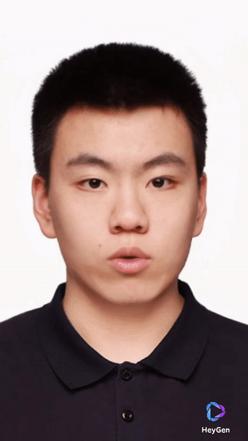
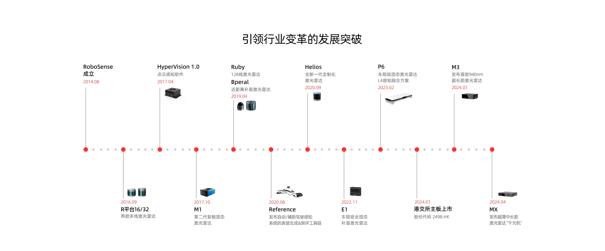
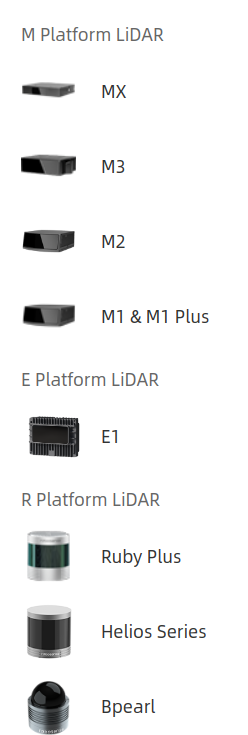
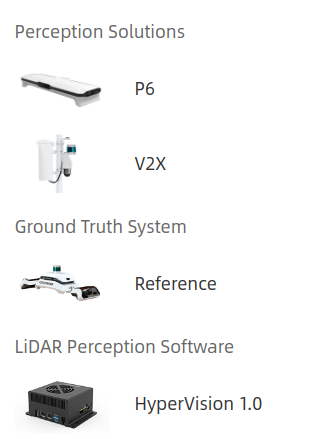

# Awesome Technology Company 

## Table of Contents

- [Awesome Technology Company ](#awesome-technology-company-)
  - [Table of Contents](#table-of-contents)
- [AI Application](#ai-application)
  - [HeyGen - AI-powered Video Creation at Scale - 数字人](#heygen---ai-powered-video-creation-at-scale---数字人)
- [Sensor 传感器](#sensor-传感器)
  - [Robosense Technology - China LiDAR Company](#robosense-technology---china-lidar-company)
    - [Products](#products)
    - [Solutions](#solutions)
    - [Partners](#partners)
    - [Recruitment ☆](#recruitment-)

---

# AI Application

## HeyGen - AI-powered Video Creation at Scale - 数字人

[HeyGen](https://www.heygen.com/)

[HeyGen 管理平台](https://app.heygen.com/home)

**Features**
1. Avatar
   1. 现成 Avatar 库 + FaceSwap换脸
   2. Instant Avatar - Digital Twin (sit/walk) - 付费可支持 private-model & studio-level
   3. Photo Avatar - 仅用一张图片(Animate/SimpleImage)
   4. Studio Avatar - 高级付费功能 Studio Level
2. Voice
   1. 现成 Voice 库
   2. Personal Voice
3. Video Translate - 视频中的内容翻译成多种语言
4. Interactive Avatar - **直播Streaming** 功能，并支持 multiple-concurrent avatars
5. Zapier - API接口 & 自动化工具，允许不同应用程序之间无缝连接和数据传输
6. LLM - 可通过 API 链接 大模型 - AI 生成文稿

上传视频要求
1. At least 3 minutes of footage
2. High resolution camera
3. Well-lit quiet environment
4. Keep your head centered in the frame
5. Ensure face visibility; do not cover your mouth
6. Use a tripod or stabilize your phone to avoid shaking

公司优势
1. 多项技术整合
2. 生成快、效率高 (用 1-2 min 视频训练)

存在问题
1. 动作较为僵硬和重复，和上传的视频动作一致，且不能根据动作进行调整
2. 不是三维建模不能与实体交互
3. 学习的语音 太过流畅、平稳，不够真实
4. 视频制作时不能实时预览效果

其他可能赛道
1. 二维数字人
2. 三维数字人(建模) - NVIDIA Omniverse
3. 虚拟偶像
4. 影视处理
5. CG
6. 游戏角色
7. AR/VR

数字人赛道风险
1. 版权 & 隐私 (HeyGen 采用录制一段 声明视频 确认是本人)

数字人技术路线(多技术驱动)
1. LipSync - 图像 匹配 文字(对嘴型)
2. TTS(Text to Speech) - 文字 转 语音(停顿、情绪) - 短视频配音
   1. [Github - TTS papers 汇总](https://github.com/coqui-ai/TTS-papers)
3. so-vits-svc - 模仿 语音语调 - AI孙燕姿
   1. [Github - so-vits-svc](https://github.com/svc-develop-team/so-vits-svc)

竞品
1. 必剪 Studio 数字分身、定制音色 素材质量要求高、训练时间长
2. D-ID
3. Wav2lip
4. Synthesia

---

# Sensor 传感器

## Robosense Technology - China LiDAR Company

[RoboSense (Chinese Official Website)](https://www.robosense.cn)

[RoboSense (English Official Website)](https://www.robosense.cn/en)

[Robosense Technology Co., Ltd (2498HK) - Yahoo Finance](https://finance.yahoo.com/quote/2498.HK)

RoboSense's full-stack systems incorporate our LiDAR sensors, proprietary system on a chip and cutting-edge perception software.

Delivering comprehensive data analytics, our customers rely on us to make critical decisions and develop better, safer solutions.

### Products

**[Products](https://www.robosense.cn/en/product)**
1. M Platform
2. E Platform
3. R Platform

### Solutions

**[Solutions](https://www.robosense.cn/en/scheme)**
1. Perception Solutions
2. Ground Truth System
3. LiDAR Perception Software

### Partners

### Recruitment ☆

[Join us](https://www.robosense.cn/about/joinus)

